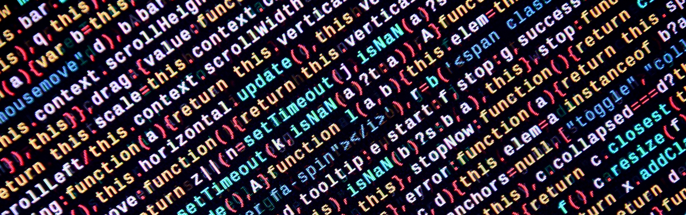

### Programming with JavaScript

10.12.23

### What is control flow?

By default, JavaScript code is executed from top to bottom, line by line. We can change that with Control Flow.

Whoop Whoop!

Control flow allows our program to make decisions about what code is executed and when. 

We can control the flow of our code. 

We did this a little bit with conditional statements that check to see if a certian condition is true or false and then if it's true, we run code A, if it's not, then we run Code B.

We can also do this with loops.

### What is a JavaScript function?

Functions are blocks of code that we can calll or invoke whenever we want. They are known as "first class objects", which means that they can be treated like objects.

### What does it mean to invoke - or call - a function?

Function Declaration:

First, you need to declare a function. This is how you define what the function does when called.

Calling the Function:

To call this function and execute its code, you use the function name followed by parentheses. If the function expects any arguments, you provide them inside the parentheses.

Remember that it's the parentheses that actually calls/invokes the function.

Using the Return Value:

The function can return a value using the return statement. You can use this return value in your code as needed.

You can call functions manually or you can call them dynamically. For instance, button click or browser refresh. These are called events. 

### What are the parenthesis () for when you define a function?

Parameters!

In JavaScript, when you define a function, the parentheses () are used to specify the parameters that the function can accept. Parameters are the variables or values that the function expects to receive when it is called, and they can be used within the function's body.

Sources

[Read about MDN Control Flow](https://developer.mozilla.org/en-US/docs/Glossary/Control_flow)

[Functions](https://www.w3schools.com/js/js_functions.asp)

[Operators](https://www.w3schools.com/js/js_operators.asp)

[Skim Expressions and Operators](https://developer.mozilla.org/en-US/docs/Web/JavaScript/Guide/Expressions_and_Operators)

[Skim about Functions](https://developer.mozilla.org/en-US/docs/Web/JavaScript/Guide/Functions)

