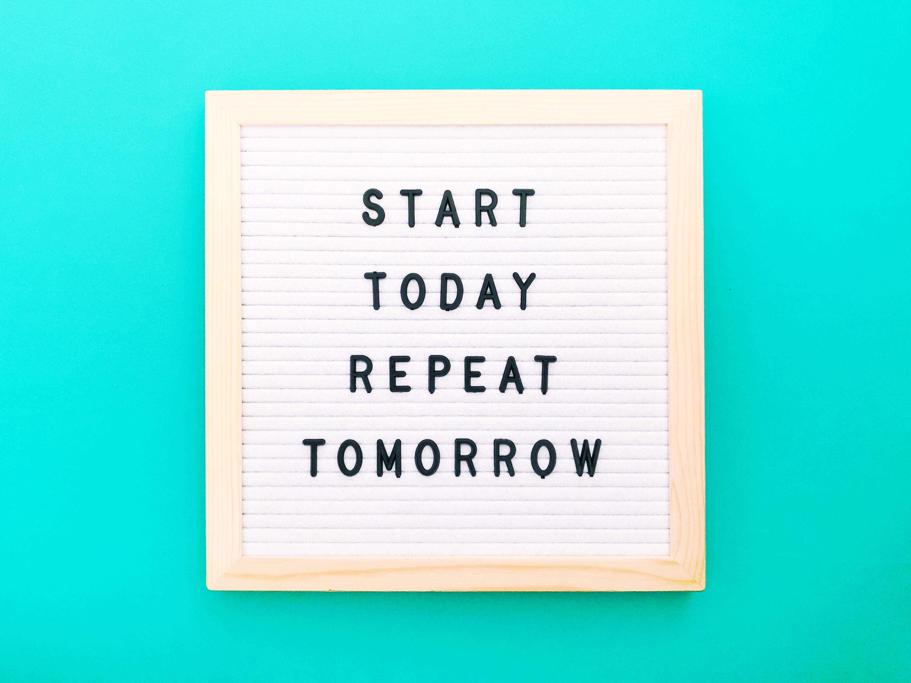
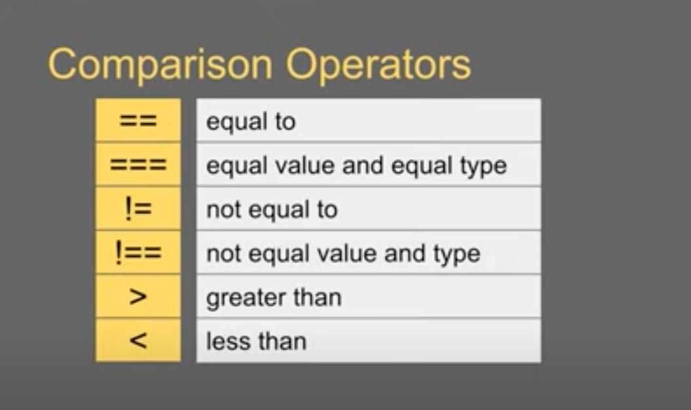

# JavaScript Loop--Dee--Loop

 10.12.23

#### Yesterday, we covered some JavaScript concepts. And today.... we will cover some *more* JavaScript concepts.

Wonder what we'll cover tomorrow.

### What is an expression in JavaScript?

An expression in JavaScript is a piece of code that produces a value. It can be a 
* single value, variable
* function call
* or a combination of operators and operands 

that result in a value. Expressions are used to perform operations, make decisions, and manipulate data.

### Why would we use a loop in our code?

Probably because good coders are lazy coders. Cue: Kassie's voice 

Like my virtual friend Mosh says, sometimes we want to repeat the same action a bunch of times. 

credit: https://www.youtube.com/watch?v=s9wW2PpJsmQ

But let's get technical. 

A loop in JavaScript is a control flow structure that allows you to execute a block of code repeatedly as long as a specified condition is true. 

What type of loops are there?

* For
* While
* Do...while
* For...in
* For...of

Loops are used to automate repetitive tasks, iterate over arrays or objects, and perform operations until a certain condition is met.

### When does a for loop stop executing?

A `for` loop in JavaScript stops executing when the specified condition in the loop header evaluates to false. The loop typically has three parts in its header: initialization, condition, and update. The loop will continue to execute as long as the condition remains true, and it will stop when the condition becomes false.

### How many times will a while loop execute?

Oh boy!

A `while` loop in JavaScript will execute as long as the specified condition in the loop header evaluates to true. It continues to execute the block of code as long as the condition remains true. Unlike a `for` loop, a `while` loop doesn't have a predetermined number of iterations; it depends on when the condition becomes false. If the condition is initially false, the loop will not execute at all.

The number of times a `while` loop will execute depends on the condition specified in the loop header. If the condition is initially true and is not modified within the loop, the loop will execute repeatedly until the condition becomes false. Therefore, the number of times a `while` loop executes can vary based on the condition and how it's modified within the loop.

### Sources:

 [Expressions and Operators](https://developer.mozilla.org/en-US/docs/Web/JavaScript/Guide/Expressions_and_Operators)
 Focusing only on Comparison Operators and Assignment Operators

   --https://www.youtube.com/watch?v=KwOTbF1kEcU

 Assignment Operators assign value to JavaScript variables

 [Loops](https://developer.mozilla.org/en-US/docs/Web/JavaScript/Guide/Loops_and_iteration)
 Focusing only on for statement and while statement loops