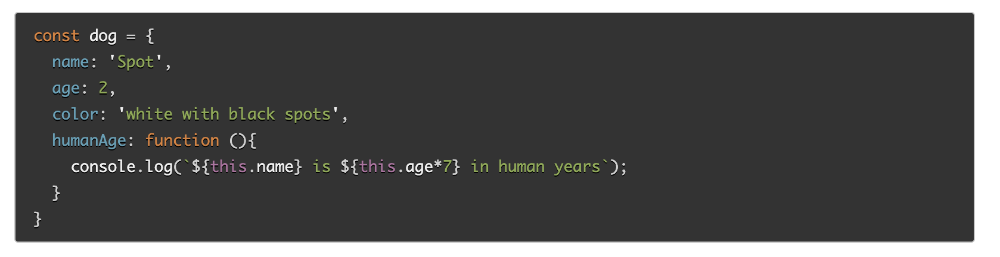

## Problem Domain, Objects, and the DOM

Date Prepared: 10.27.23

Class Six: 10.30.23

The purpose and emphasis of this reading assignment is give an introduction to DOM Modeling. 

### JS Object Basics

#### How would you describe an object to a non-technical friend you grew up with?

Imagine you have a notebook where you can write down different things about a particular subject. This notebook has various sections or pages, each containing information related to that subject. Each section has a title, and under each title, you can write specific details or attributes about that subject. That's similar to what an "object" is in programming. It's like a digital notebook that helps us organize information about something in a structured way. Each attribute is like a piece of information, and you can use the title to quickly find and access the information you need.

#### What are some advantages to creating object literals?

* Organization: Objects help you organize and structure related information in a clear and logical way.

* Readability: Objects make the code more readable, as you can access attributes by name instead of remembering array indices.

* Reusability: You can create templates for similar objects, making it easy to reuse and manipulate the data.

#### How do objects differ from arrays?

* Objects are used to store and organize related data with named properties (keys), while arrays are used to store a collection of data with numeric indices.

* Objects use key-value pairs to represent data, making it easy to access information by name, while arrays use numeric indexes to access data.

* Objects are typically used when data has named attributes, and you want to access the data using those names. Arrays are used when you have a list of items and want to access them sequentially by index.

#### Give an example for when you would need to use bracket notation to access an object’s property instead of dot notation.

You would use bracket notation to access an object's property instead of dot notation when the property name contains special characters, spaces, or when the property name is stored in a variable. 

#### Evaluate the code below. What does the term this refer to and what is the advantage to using this?

Evaluating the Code with "this":
In the provided code, the `this` keyword refers to the current object, which is `dog`. This code defines an object called `dog` with properties like `name`, `age`, `color`, and a method (function) called `humanAge`.

The advantage of using `this` in this context is that it allows you to access properties of the current object, which makes the code more flexible and reusable. The `humanAge` method uses `this` to access the `name` and `age` properties of the `dog` object, and it calculates the dog's age in human years based on those properties. If you had multiple dog objects with different names and ages, you could reuse this method for each of them without modification, thanks to `this` referring to the specific object it's called on.

### Intro to the DOM

#### What is the DOM?

The DOM, or Document Object Model, is a programming interface for web documents. It represents the structure of a web page, enabling programs (typically written in JavaScript) to interact with and manipulate the content, structure, and style of a webpage dynamically.

#### Briefly describe the relationship between the DOM and JavaScript.

The relationship between the DOM and JavaScript is as follows:

1. JavaScript and the DOM are closely intertwined: JavaScript is the primary language used to interact with and manipulate the DOM.

2. JavaScript can access the DOM to:
   - Retrieve elements on a webpage (e.g., finding and reading HTML elements).
   - Modify content (e.g., changing text or attributes of HTML elements).
   - Change the structure of the document (e.g., adding or removing elements).
   - Respond to user events (e.g., handling clicks or form submissions).

3. JavaScript can use the DOM as a bridge to connect user interactions with the logic and functionality of a web application.

Basically, JavaScript and the DOM work together to create dynamic, interactive web pages. JavaScript can modify the DOM in response to user actions or other events, providing interactivity and responsiveness.

**Sources**

[JS Object Basics](https://developer.mozilla.org/en-US/docs/Learn/JavaScript/Objects/Basics)

[Intro to the DOM](https://developer.mozilla.org/en-US/docs/Web/API/Document_Object_Model/Introduction)

**Bookmark & Review**

[Understanding the problem domain is the hardest part of programming](http://simpleprogrammer.com/2013/07/15/understanding-the-problem-domain-is-the-hardest-part-of-programming)

## Things I want to know more about
