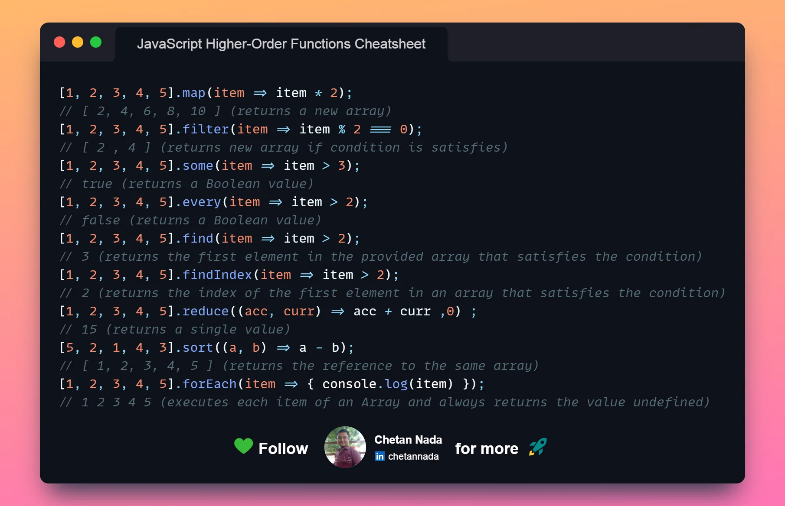

# Conditional Rendering, Routing

## Class 5: 12.1.23

Prepared: 11.30.23


**Summary/Statement:** This assignment delves into the React documentation's insights on "Thinking in React," exploring the single responsibility principle in components and the process of building applications iteratively. We also cover higher order functions. 

### Reading: React Docs - Thinking in React

[React Docs - Thinking in React](https://reactjs.org/docs/thinking-in-react.html)

1. **What is the single responsibility principle, and how does it apply to components?**  
   - The single responsibility principle dictates that a component should ideally do only one thing. It should be responsible for one aspect of the UI or functionality, ensuring clear, focused, and reusable code.

2. **What does it mean to build a ‘static’ version of your application?**  
   - Building a 'static' version involves creating a non-interactive representation of the UI, typically without dynamic behavior or state. It's about setting up the visual structure and layout of the application.

3. **Once you have a static application, what do you need to add?**  
   - After creating a static application, you need to add interactivity by introducing state, enabling user interactions, and handling dynamic data.

4. **What are the three questions you can ask to determine if something is state?**  
   - Does it change over time? 
   - Can it be computed based on other state or props? 
   - Does it need to be passed to other components?

5. **How can you identify where state needs to live?**  
   - State should live in the lowest common ancestor component for the components that need access to that state. It should be located where it can be efficiently shared and updated among relevant components.

### Higher-Order Functions

[Link to Higher-Order Functions Reading Material](https://eloquentjavascript.net/05_higher_order.html#h_xxCc98lOBK)

6. **What is a “higher-order function”?**  
   - A higher-order function is a function that either takes another function as an argument or returns a function as its result.

7. **Explore the greaterThan function as defined in the reading. In your own words, what is line 2 of this function doing?**  
   - Line 2 of the `greaterThan` function seems to define a function that takes a parameter `n` and returns another function that evaluates whether the input value is greater than `n`.

A more detailed interpretation provided by ChatGPT:

```javascript
function greaterThan(n) {
  return m => m > n;
}
let greaterThan10 = greaterThan(10);
console.log(greaterThan10(11));
// → true
```


   - This function `greaterThan` is a higher-order function that takes a single argument `n`.
   - Inside the function body, it returns an anonymous function using the arrow function syntax (`m => m > n`).
   - The returned function takes a parameter `m` and returns a boolean value (`true` or `false`) by comparing if `m` is greater than the value of `n`.


8. **Explain how either map or reduce operates, with regards to higher-order functions.**  
   - Map and reduce are higher-order functions in JavaScript. Map transforms each element in an array with a given function and returns a new array. Reduce, on the other hand, accumulates a value by applying a function to each element and reducing it to a single output.


### Resources

[Article on State](https://dev.to/reedbarger/what-is-state-and-why-should-we-care-about-it-4o95)

Higher Order Functions Cheatsheet



### Things I want to know more about


