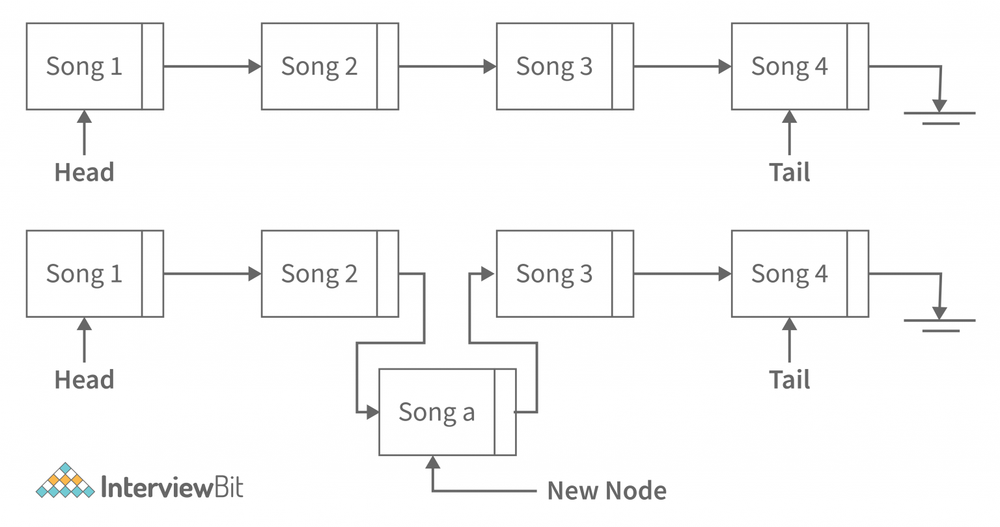

# Implementation Linked Lists

## 1.12.24

## Music Playlist Example




[Helpful Breakdown](https://www.interviewbit.com/blog/types-of-linked-list/)


**Concept:**

- Each song in the playlist is represented as a "node" in the linked list.
- Each node contains two parts:
    - **Song information:** The actual data about the song (title, artist, genre, etc.).
    - **Next song pointer:** A reference to the next node in the playlist.

**Building the Playlist:**

1. **Create song nodes:**
    - Imagine each song on a card with its details and an arrow pointing to the next card.
    - Create nodes for your chosen songs, e.g., "Bohemian Rhapsody", "Dancing Queen", and "Mr. Brightside".

2. **Link the nodes:**
    - Start with the first song ("Bohemian Rhapsody").
    - Connect its "next song pointer" to the "Dancing Queen" node.
    - Similarly, connect "Dancing Queen" to "Mr. Brightside".
    - The last node ("Mr. Brightside") points to **None**, indicating the end of the list.

**Visualizing the Music Playlist:**

```
[Bohemian Rhapsody] -> [Dancing Queen] -> [Mr. Brightside] -> None
```

**Navigation:**

- **Play next song:** Follow the "next song pointer" from the current node (e.g., "Dancing Queen" after playing "Bohemian Rhapsody").
- **Go back a song:** Doubly linked lists can point the other way too, allowing you to revisit previous songs easily.

**Advantages:**

- **Dynamic additions/deletions:** Easily add or remove songs from any position without shifting the entire list.
- **Efficient shuffling:** The playlist can be rearranged by adjusting pointers, making shuffling a breeze.
- **Memory efficiency:** Only used memory for actually stored songs, not wasted space for empty slots.

**Key Points:**

- Linked lists are ideal for music playlists due to their flexibility and efficient navigation.
- They are not the only data structure used for playlists, but offer valuable functionality.

**Additional Insights:**

- Dynamic Playlists: Linked lists enable easy additions, removals, and rearrangements without significant overhead, making them ideal for dynamic playlists.

- Bidirectional Traversal: Doubly linked lists allow navigation both forwards and backwards, enabling features like skipping to the previous song.

- Memory Efficiency: Only necessary memory is used, avoiding wasted space for unused slots, which is common in arrays.
