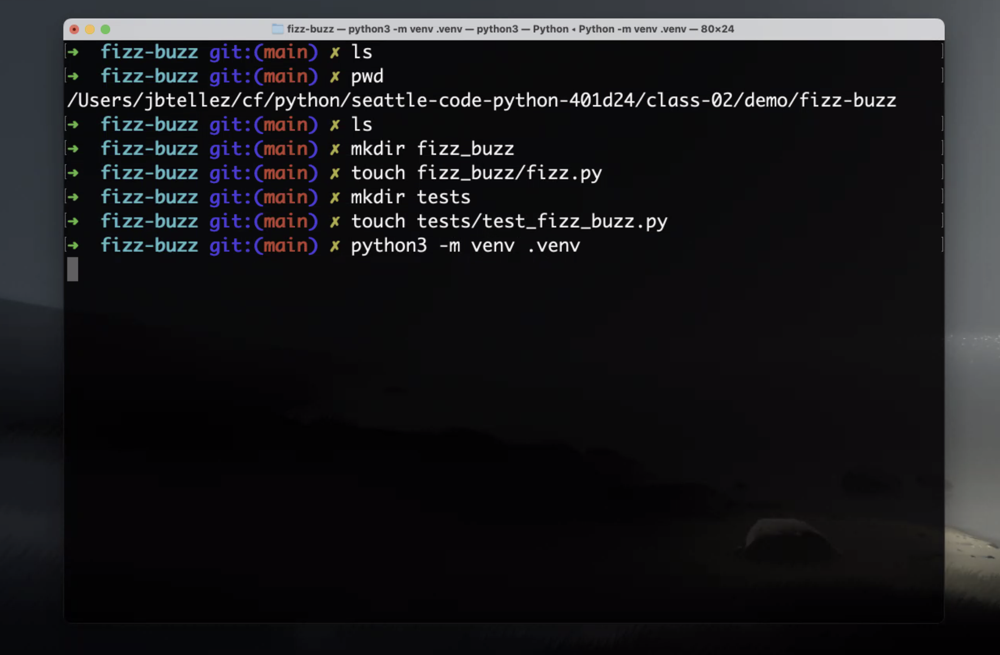
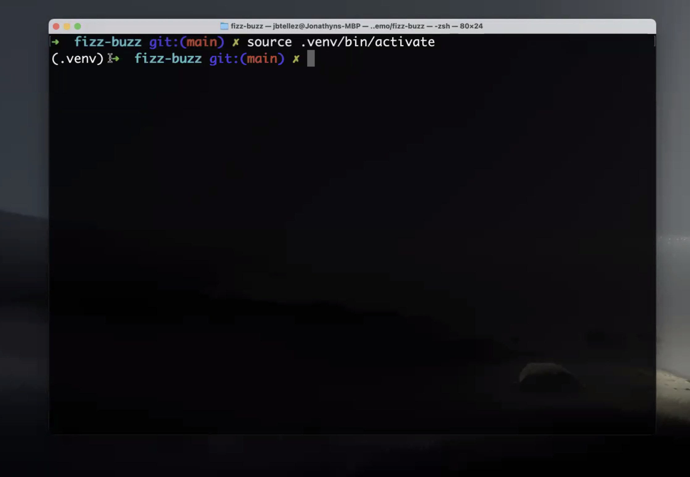
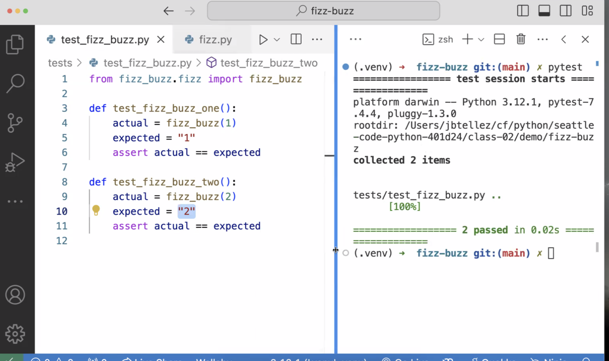

# Test Driven Development 

## Notes from Class - 1/9/24

__pycache__ is a directory that is created when you run python and it is used to store the compiled python files.

touch tests/__init__.py

Header for test_fizz_buzz.py:

from fizz_buzz.fizz import fizz_buzz

def test_fizz_buzz_one():
  actual = fizz_buzz(1)
  expected = "1"

To make this an official test you have to use the keyword assert

def test_fizz_buzz_one():
  actual = fizz_buzz(1)
  expected = "1"
  assert actual == expected

def fizz_buzz(num):
  return str(num)

Code for 3 and 5:

def fizz_buzz(num):
  if num % 3 == 0 and num % 5 == 0:
    return "FizzBuzz"

  if num % 3 == 0:
    return "Fizz"

  if num % 5 == 0:
    return "Buzz"
  return str(num)

Test for four

def test_fizz_buzz_four():
  actual = fizz_buzz(4)
  expected = "4"
  assert actual == expected

def test_fizz_buzz_five():
  actual = fizz_buzz(5)
  expected = "Buzz"
  assert actual == expected

def test_fizz_buzz_fifteen():
  actual = fizz_buzz(15)
  expected = "FizzBuzz"
  assert actual == expected