# Introduction to SQL

## Prework 1.6.25

### Resource - [SQL Bolt](https://sqlbolt.com/)

### Results

Lesson 1 -
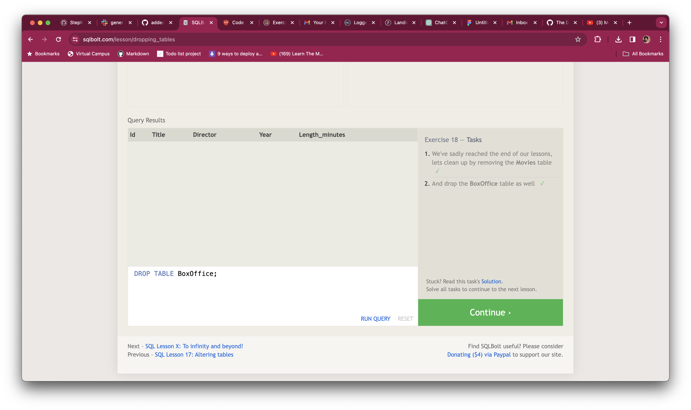

Lesson 2 -
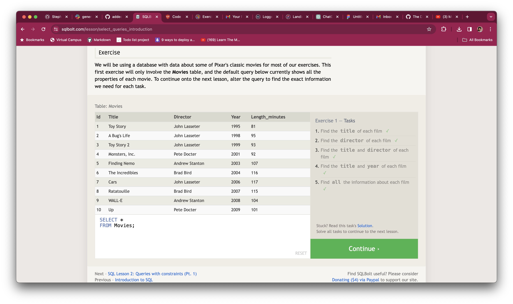

Lesson 3 -
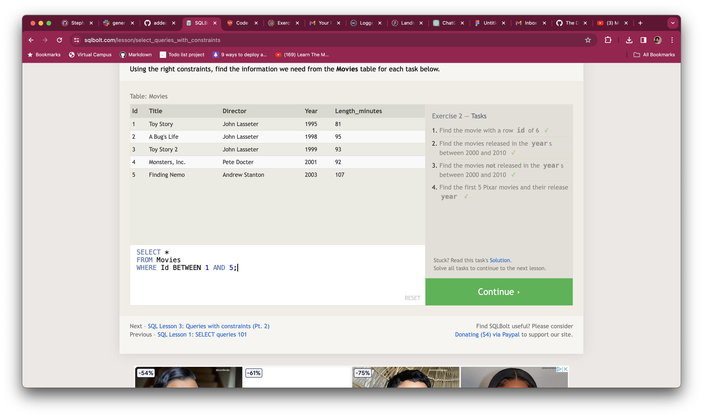

Lesson 4 -
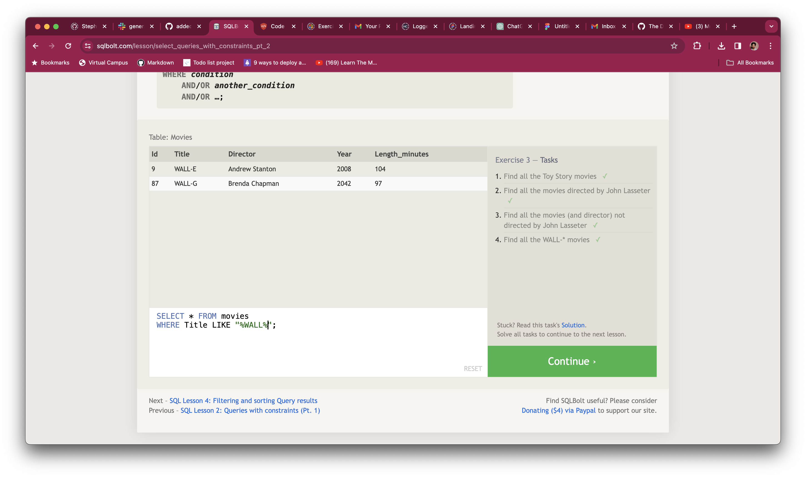

Lesson 5 -
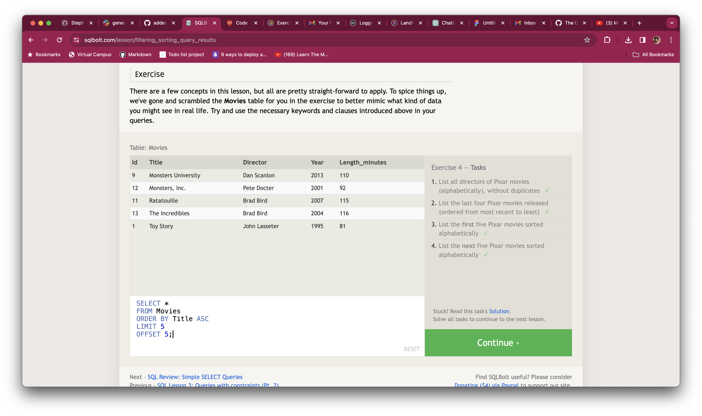

Lesson 6 -
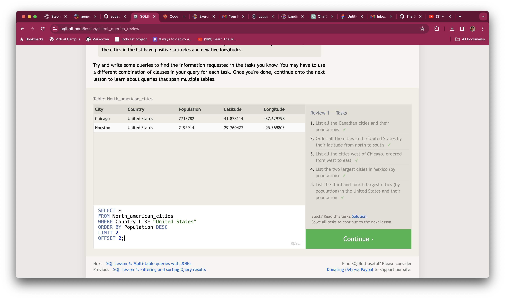

Lesson 13 -
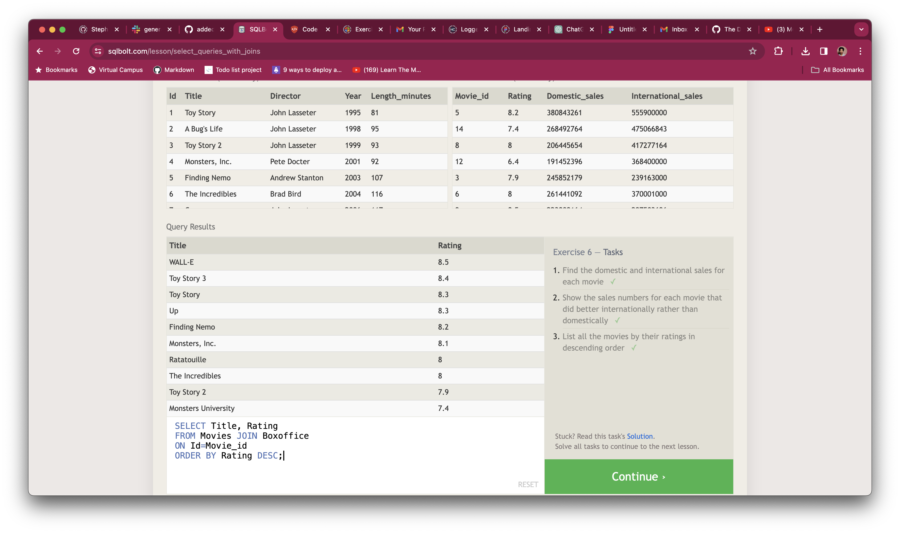

Lesson 14 -
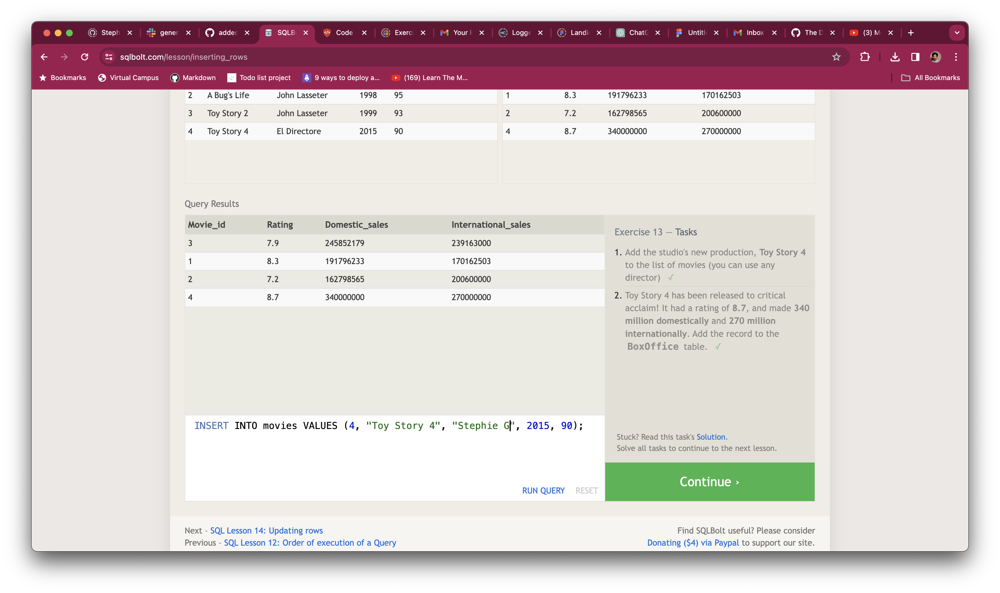

Lesson 15 -
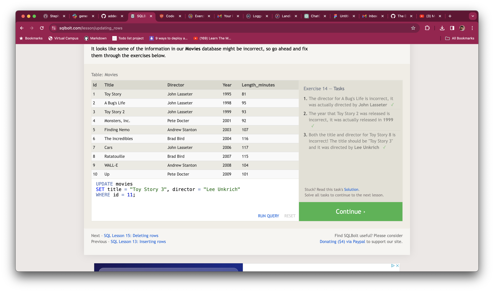

Lesson 16 -
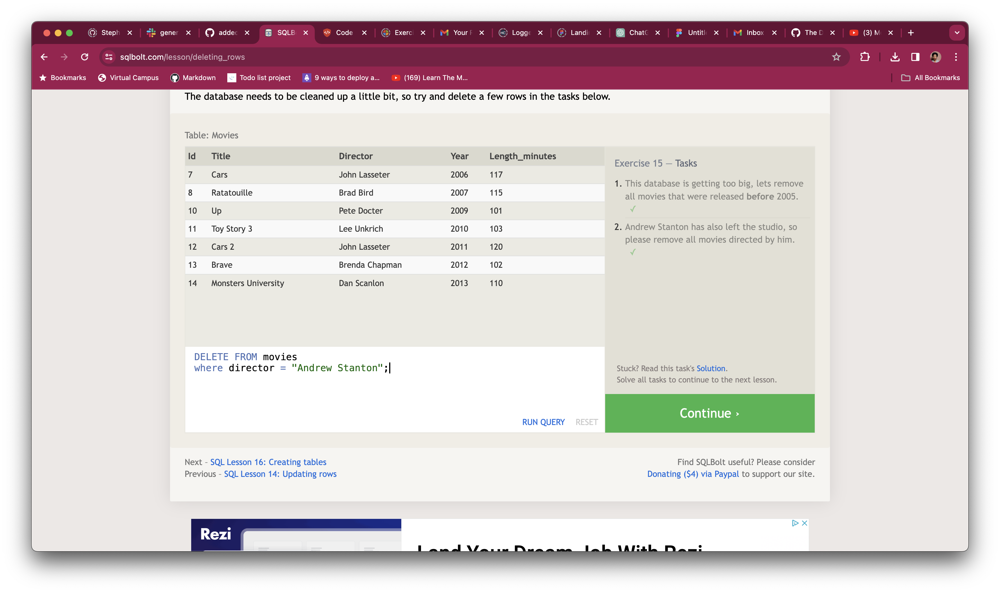

Lesson 17 -
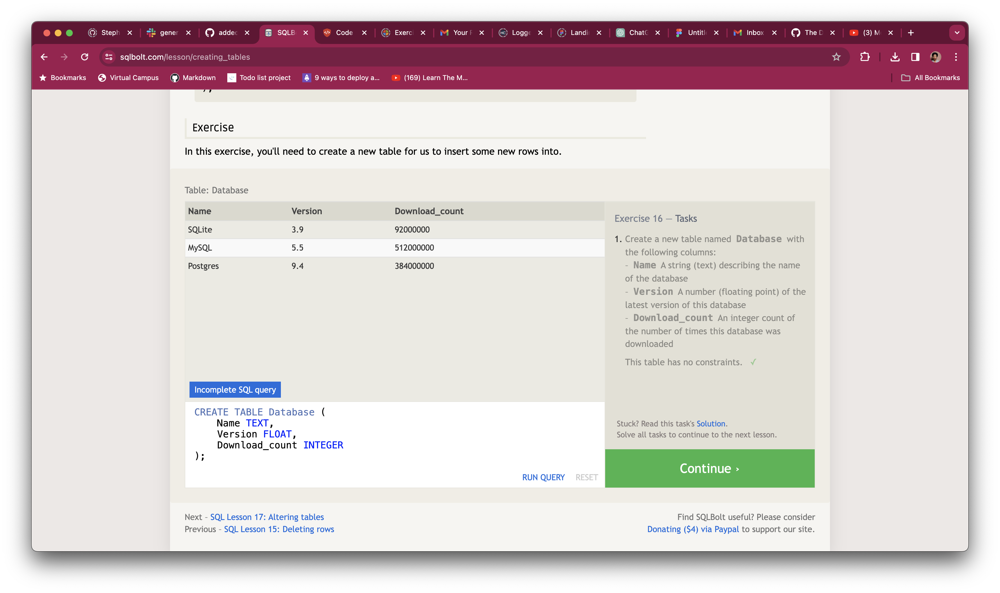

Lesson 18 -
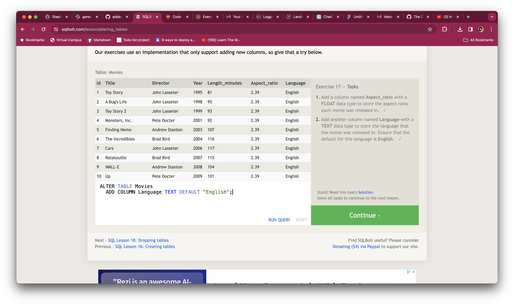

### Impressions

Relational databases are systems used to store and manage data in a structured way. They organize information into tables, where each table contains rows (entries) and columns (attributes or fields). These tables are related to each other based on common elements, enabling connections between different pieces of data.

SQL (Structured Query Language) is a language used to interact with relational databases. It allows users to perform various operations on the data, such as retrieving specific information, adding new data, updating existing records, and deleting data.

I think of a relational database as a collection of spreadsheets. Each spreadsheet is a table, with rows representing individual records (like entries in an address book), and columns representing different attributes (like name, address, phone number). SQL acts as the language that helps you ask questions and perform actions on these spreadsheets, such as asking for specific names or updating phone numbers. Our examples above included movies and the movie attributes. Which was cool.